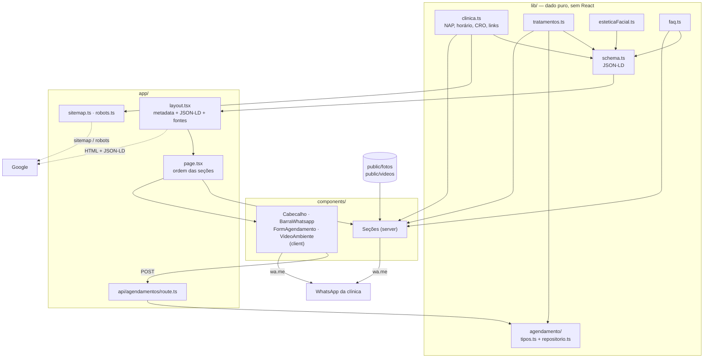
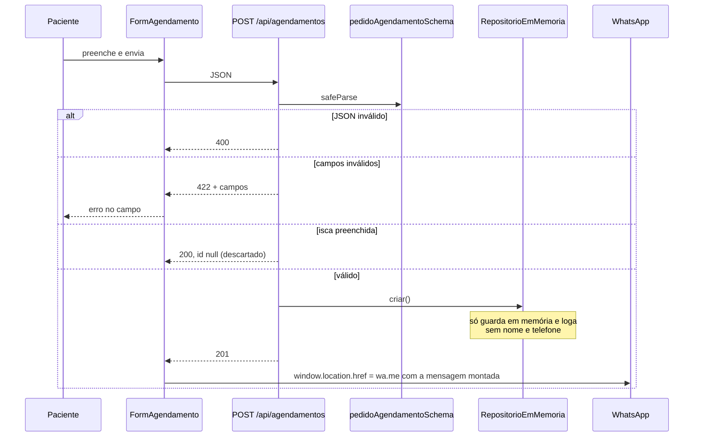
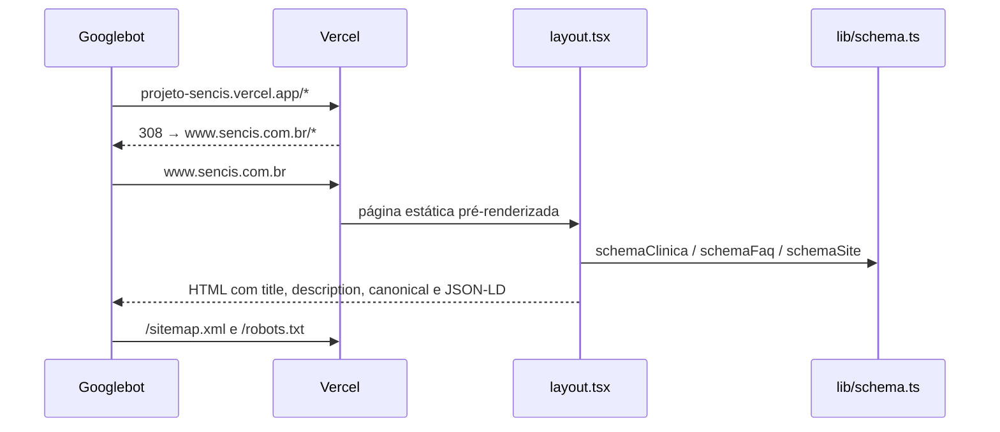

# Mapa do código

> Gerado pelo Cartographer. Último mapeamento: 23/09/2026.
> Contagem sem o fixture `tests/fixtures/schemaorg-vocabulario.jsonld` (1,5 MB).

Site de página única da **Sencis Odontologia Integrada** (Parque Amazônia,
Goiânia/GO). Não há banco nem autenticação: o conteúdo é dado estático em
`lib/`, renderizado no servidor, e o único ponto dinâmico é
`POST /api/agendamentos`, que valida o pedido e devolve o paciente para o
WhatsApp da clínica.

## Visão geral



## Estrutura de diretórios

```
sencis/
├── app/
│   ├── layout.tsx              # <html>, metadata, viewport, fontes, JSON-LD
│   ├── page.tsx                # monta as seções na ordem de rolagem
│   ├── not-found.tsx           # 404
│   ├── globals.css             # tokens @theme do Tailwind 4 + animações
│   ├── sitemap.ts · robots.ts  # gerados pela Metadata API
│   └── api/agendamentos/route.ts
├── components/                 # uma seção por arquivo + Marca e icones
├── lib/
│   ├── clinica.ts              # FONTE ÚNICA de nome/endereço/telefone/horário
│   ├── tratamentos.ts · esteticaFacial.ts · faq.ts   # conteúdo
│   ├── schema.ts               # JSON-LD de busca local
│   └── agendamento/            # contrato zod + repositório (encaixe do backend)
├── public/
│   ├── fotos/                  # 13 fotos, kebab-case pelo que mostram
│   ├── videos/                 # 4 clipes .mp4 + 4 pôsteres
│   ├── icone.svg · og.jpg
├── tests/
│   ├── unidade/                # zod, rota da API e contraste de cores
│   ├── seo/                    # schema, metadados e HTML gerado
│   └── fixtures/schemaorg-vocabulario.jsonld   # vocabulário oficial, CC BY-SA
├── docs/
│   ├── visibilidade-google.md  # plano de SEO local (não técnico)
│   └── CODEBASE_MAP.md         # este arquivo
└── .github/workflows/testes.yml
```

## Guia dos módulos

### `lib/` — dados

**Propósito**: todo o conteúdo e os dados institucionais. Nenhum arquivo aqui
importa React nem imagem; é dado puro, consumido pelos componentes, pelo
JSON-LD e pelos testes.

| Arquivo | Propósito | Tokens |
|---|---|---|
| `lib/clinica.ts` | NAP, horário, CRO, redes, `siteUrl` e os links derivados | 1183 |
| `lib/tratamentos.ts` | Os 6 grupos de tratamento, na linguagem de quem busca | 1048 |
| `lib/esteticaFacial.ts` | Botox, harmonização e limpeza de pele, com `escopoDentista` | 598 |
| `lib/faq.ts` | 8 perguntas reais (viram a seção e o `FAQPage`) | 932 |
| `lib/schema.ts` | `schemaClinica()` (`Dentist`), `schemaFaq()` (`FAQPage`), `schemaSite()` (`WebSite`) | 1589 |

**Exports de `lib/clinica.ts`**:
- `clinica` (`as const`): `nome`, `nomeCurto`, `slogan`, `telefone.{e164, formatado}`,
  `whatsapp.{numero, mensagemPadrao}`, `endereco.{logradouro, complemento, bairro, cidade, estado, cep, pais}`,
  `geo.{latitude, longitude}`, `horarios[]`, `responsavel.{nome, cargo, cro}`,
  `croClinica`, `avaliacoes`, `social`, `siteUrl`
- `enderecoLinhaUnica`, `linkWhatsapp` (mensagem padrão), `whatsappSobre(assunto)`
  (mensagem contextual), `linkComoChegar` (rota por nome), `linkMapaEmbed`
  (por coordenada)

**Tipos**: `Tratamento { id, nome, resolve, descricao, tambemChamado[] }`,
`ServicoComplementar { id, nome, descricao, escopoDentista }`,
`Pergunta { pergunta, resposta }`.

**Dependentes**: praticamente tudo. `clinica.ts` é importado por `layout`,
`sitemap`, `robots`, `schema` e por quase todos os componentes.

### `lib/agendamento/` — encaixe do backend

| Arquivo | Propósito | Tokens |
|---|---|---|
| `lib/agendamento/tipos.ts` | Schema zod, tipos, rótulos e formatação de telefone | 873 |
| `lib/agendamento/repositorio.ts` | Interface `RepositorioAgendamentos`, implementação em memória e fábrica | 521 |

**Exports**:
- `pedidoAgendamentoSchema`: `nome` (2–120), `telefone` (normaliza para dígitos,
  exige 10 ou 11), `tratamento` (enum `"nao-sei"` + ids de `tratamentos`,
  padrão `"nao-sei"`), `periodo` (`manha | tarde | qualquer`, padrão
  `"qualquer"`), `observacoes` (≤600, opcional), `sobrenome` (isca, opcional)
- `PedidoAgendamento`, `Agendamento` (`+ id, criadoEm, status, origem`),
  `periodos`, `Periodo`, `rotuloPeriodo`, `nomeDoTratamento(id)`,
  `telefoneFormatado(digitos)`
- `RepositorioAgendamentos { criar, listar }` e `obterRepositorio()`, um
  singleton de `RepositorioEmMemoria`, classe não exportada

**Dependentes**: `app/api/agendamentos/route.ts`, `components/FormAgendamento.tsx`.

### `app/` — entrada

| Arquivo | Propósito | Tokens |
|---|---|---|
| `app/layout.tsx` | `metadata`, `viewport`, fontes Jost + Instrument Sans, `<script type="application/ld+json">` com `[schemaClinica(), schemaFaq(), schemaSite()]` | 1235 |
| `app/page.tsx` | Ordem das seções e o link "Pular para o conteúdo" | 331 |
| `app/globals.css` | Tokens `@theme`, override de `--color-texto` em `.bg-nude`, `.transicao`, `.anim-bloom`, `.anim-rise`, `.lista-filete`, `.select-seta`, `.faq-sinal` | 2009 |
| `app/sitemap.ts` | URL única + 6 fotos para a busca de imagens | 280 |
| `app/robots.ts` | `allow: /`, `disallow: /api/` | 77 |
| `app/not-found.tsx` | Página 404 | 231 |
| `app/api/agendamentos/route.ts` | `POST` e `GET` (405); `runtime = "nodejs"`, `dynamic = "force-dynamic"` | 453 |

**Respostas de `/api/agendamentos`**:

| Código | Quando |
|---|---|
| 201 | Pedido válido: `{ ok: true, id, status: "solicitado" }` |
| 200 | Isca `sobrenome` preenchida: `{ ok: true, id: null }`, descartado em silêncio |
| 422 | Falha no zod: `{ ok: false, erro, campos }` |
| 400 | Corpo não é JSON |
| 405 | `GET`, com header `Allow: POST` |

### `components/` — seções

Ordem de rolagem definida em `app/page.tsx`:

| # | Componente | Âncora | Tipo | Tokens | Nota |
|---|---|---|---|---|---|
| — | `Cabecalho` | — | client | 1456 | Fixo; menu mobile fica **fora** do `<header>` |
| 1 | `Hero` | `#topo` | server | 1440 | h1, a única imagem `fetchPriority="high"` (o LCP), único uso de `.transicao` e animação |
| 2 | `Tratamentos` | `#tratamentos` | server | 1576 | Clipe de vídeo por tratamento (mapa `clipes`) |
| 3 | `EsteticaFacial` | `#estetica-facial` | server | 1065 | Faixa de peso visual menor, de propósito |
| 4 | `CameraIntraoral` | `#camera-intraoral` | server | 1112 | Texto da própria clínica |
| 5 | `Clinica` | `#clinica` | server | 943 | Origem do nome; sem retrato de dentista |
| 6 | `Estrutura` | `#estrutura` | server | 1517 | Mosaico de 6 fotos + cartão de CTA |
| 7 | `Agendar` | `#agendar` | server | 459 | Única faixa escura; contém `FormAgendamento` |
| 8 | `Perguntas` | `#perguntas` | server | 575 | `<details>` nativo, sem JS |
| 9 | `Localizacao` | `#localizacao` | server | 1162 | Endereço, horário, mapa em `<iframe>` |
| — | `Rodape` | — | server | 659 | Responsável técnica e CRO (exigência legal) |
| — | `BarraWhatsapp` | — | client | 383 | Só no celular, só depois do hero |

Apoio:

| Arquivo | Propósito | Tokens |
|---|---|---|
| `components/FormAgendamento.tsx` | Formulário (client): envia para a API e redireciona ao WhatsApp | 2333 |
| `components/VideoAmbiente.tsx` | `<video>` mudo em loop; pôster e vídeo só perto da tela (client) | 713 |
| `components/Marca.tsx` | Logotipo composto em texto; props `tom` e `tamanho` | 451 |
| `components/icones.tsx` | 8 ícones SVG inline (`IconeWhatsapp`, `IconeEstrela`…) | 1628 |

### `tests/`

| Arquivo | O que trava | Precisa de build? |
|---|---|---|
| `tests/unidade/agendamento.test.ts` | Normalização de telefone, nome, defaults, enum de tratamentos, isca aceita pelo schema | Não |
| `tests/unidade/rota-agendamentos.test.ts` | 201 / 422 / 400 / 200 da isca / 405 | Não |
| `tests/unidade/contraste.test.ts` | Contraste ≥4,5:1 dos pares de tokens lidos do `globals.css` (inclusive o override de `.bg-nude`) e de todo `text-nude/NN` nas faixas escuras | Não |
| `tests/seo/schema.test.ts` | NAP e horário iguais aos de `clinica.ts`, catálogo de serviços, sem `aggregateRating`, fotos existentes, **toda propriedade conferida contra o vocabulário schema.org** | Não |
| `tests/seo/metadados.test.ts` | Título ≤60, descrição 120–155, canonical, OG, zoom liberado, sitemap, robots, redirect do domínio antigo | Não (mocka `next/font/google`) |
| `tests/seo/html.test.ts` | Um h1, `lang`, NAP visível, alt em toda imagem, `aria-label` em todo vídeo, âncoras resolvem, `noopener`, número do WhatsApp, "dentista" ≥4× no texto, uma única imagem de destaque fora de ancestral animado, nenhum `<video poster>` no HTML | **Sim**: lê `.next/server/app/index.html` e se pula sem ele |

### Configuração

| Arquivo | O que importa |
|---|---|
| `package.json` | `typecheck` = `next typegen && tsc --noEmit`; `lint` = `eslint`; `test:seo` = build + suíte SEO |
| `eslint.config.mjs` | `eslint-config-next` (core-web-vitals + typescript); `no-explicit-any` desligado só em `tests/` |
| `next.config.ts` | AVIF/WebP, 3 headers de segurança, redirect 308 de `projeto-sencis.vercel.app` |
| `vercel.json` | `framework: "nextjs"`; sem ele a Vercel tratou o projeto como estático e deu 404 |
| `vitest.config.mts` | Alias `@` → raiz, ambiente `node`, `tests/**/*.test.ts`. `.mts` porque o pacote é CommonJS |
| `.github/workflows/testes.yml` | `npm ci` → `typecheck` → `lint` → `build` → `test`, em push na `main` e em PR |
| `.claude/launch.json` | Servidor `sencis`: `npm run dev` na porta 3000 |

## Fluxos

### Pedido de agendamento



A entrega real é o WhatsApp. O repositório **não persiste nada**.

### Como o Google lê a página



### Vídeo de tratamento

`Tratamentos` passa `src`/`poster` (strings `/videos/...`) para `VideoAmbiente`,
que faz três coisas em momentos diferentes:

1. **Pôster**: só é atribuído quando o vídeo chega a 800 px da tela. Antes, o
   contêiner mostra o fundo nude, com a proporção já reservada.
2. **Vídeo**: `src` só com movimento permitido; `preload="none"` segura o
   download até o `play()`.
3. **Play/pause**: quando 35% do vídeo está visível ou deixa de estar.

## Mídia

Fotos são **import estático** (`import x from "@/public/fotos/..."`) passado a
`next/image` com `placeholder="blur"`. Vídeos são **string de caminho** no
`<video>`.

| Arquivo | Onde aparece | Também em |
|---|---|---|
| `recepcao-poltronas.png` | `Hero` (`fetchPriority="high"`) | sitemap, schema `image` |
| `fachada.png` | `Estrutura` | sitemap, schema `image`, fonte do `og.jpg` |
| `consultorio-janela.png` | `Estrutura` | sitemap, schema `image` |
| `recepcao-sofa.png`, `recepcao-cafe.png`, `corredor.png`, `consultorio-bancada.png` | `Estrutura` | — |
| `planejamento.jpg` | `Clinica` | sitemap |
| `camera-intraoral.jpg` | `CameraIntraoral` | sitemap |
| `camera-intraoral-detalhe.jpg` | `CameraIntraoral` | — |
| `implantes-lentes-porcelana.jpg` | `Tratamentos` | sitemap |
| `botox-testa-antes-depois.jpg`, `harmonizacao-facial-montagem.jpg` | `EsteticaFacial` | — |
| `videos/clareamento.mp4` | `Tratamentos` → `estetica` | — |
| `videos/ortodontia-manutencao.mp4` | `Tratamentos` → `ortodontia` | — |
| `videos/implantes.mp4` | `Tratamentos` → `implantes-e-proteses` | — |
| `videos/endodontia-canal.mp4` | `Tratamentos` → `endodontia` | — |
| `icone.svg` | favicon | schema `logo` |
| `og.jpg` | Open Graph e Twitter | — |

## Convenções

- **Identificadores em português**: componentes, funções, tipos e arquivos
  (`Cabecalho`, `whatsappSobre`, `obterRepositorio`, `tambemChamado`).
- **Fotos em kebab-case pelo que mostram** (`recepcao-poltronas.png`), nunca
  pelo nome que veio do celular.
- **Separação dado/visual**: `lib/` não importa imagem. O mapa de fotos ou
  vídeos por item mora no componente (`clipes` em `Tratamentos`, `fotos` em
  `EsteticaFacial`), chaveado pelo `id` do dado.
- **Server por padrão**: `"use client"` só em `Cabecalho`, `BarraWhatsapp`,
  `FormAgendamento` e `VideoAmbiente`, os que têm estado, efeito ou
  observador.
- **Cores só por token** (`bg-ink`, `text-azul`, `bg-nude`, `text-texto`…),
  definidos em `app/globals.css`. A cartela é a oficial da marca: `azul
  #4a6b8c`, `bege #c9b29b`, `ink #2b2e31`, `nude #e6d8c8`, `areia #f4f1ea`.
  Texto sobre o nude usa `text-texto` normal (a seção ajusta o tom sozinha);
  texto azul sobre o nude usa `text-azul-fundo`.
- **Comentário explica o porquê**, geralmente com a história da decisão
  ("a clínica pediu…", "o site antigo…"). Leia antes de "simplificar".
- **Ícones inline** em `icones.tsx`, sem biblioteca externa.
- **Movimento só no hero**, uma vez; `prefers-reduced-motion` desliga tudo.

## Pegadinhas

- **Horário mora em dois lugares.** `clinica.horarios` guarda o texto exibido e
  `lib/schema.ts` tem `horarioAtendimento` escrito à mão. Mudou um, mude o
  outro: `schema.test.ts` compara os dois e falha se divergirem.
- **`siteUrl` precisa ser `https://www.sencis.com.br`**, com www. O redirect em
  `next.config.ts` e o domínio de produção na Vercel têm de bater com ele; os
  testes conferem.
- **NAP igual em todo lugar.** Endereço e telefone do site precisam ser
  idênticos aos do Perfil da Empresa no Google. Edite só `lib/clinica.ts`.
- **A isca `sobrenome` não usa `.max(0)`.** Rejeitar no schema devolveria um 422
  com o nome do campo, ensinando o robô. Quem descarta é a rota, com 200.
- **O repositório não persiste.** Não troque o redirecionamento ao WhatsApp por
  "confirmação na tela" sem plugar um destino que avise alguém.
- **Sem `aggregateRating`, de propósito.** Avaliação da própria empresa no
  próprio site é *self-serving review* para o Google. A nota aparece na tela,
  fora do schema; o teste proíbe a propriedade.
- **Limpeza de pele fica fora do JSON-LD `Dentist`** (`escopoDentista: false`):
  normalmente não é do escopo legal de dentista. Botox e harmonização entram
  (Harmonização Orofacial, CFO-198/2019).
- **Nenhuma dentista em destaque na UI.** A clínica pediu para remover o cartão
  da responsável técnica; ela aparece só no rodapé, por exigência do CFO
  (Resolução 196/2019).
- **O menu mobile fica fora do `<header>`.** O `backdrop-filter` do header cria
  um containing block para `position: fixed`, e o painel encolhia para 73px.
- **Os dois menus divergem.** `secoes` no `Cabecalho` tem 5 âncoras;
  `navegacao` no `Rodape` tem 8 (inclui `#estetica-facial`, `#camera-intraoral`
  e `#agendar`). Seção nova precisa ser adicionada nos dois, se couber.
- **Ordem dos gradientes em `.transicao` importa**: o azul vem primeiro para
  pintar por cima do bege.
- **`html.test.ts` se pula sem build.** `npm test` puro não roda a suíte de
  HTML; use `npm run test:seo` ou rode `npm run build` antes. No CI ela roda.
- **`typecheck` precisa do `next typegen`.** `next-env.d.ts` (tipos de import de
  imagem) está no `.gitignore`; sem gerar, um clone limpo dá 13 erros `TS2307`.
- **`.gitignore` usa `/videos/` com barra**: sem ela, a regra casaria
  `public/videos/` e os clipes processados sumiriam do deploy. `/videos/` e
  `/bruto/` na raiz são material bruto da clínica.
- **`.bg-nude` redefine `--color-texto`.** No fundo nude o texto padrão teria
  4,1:1; a regra em `globals.css` escurece o token dentro de qualquer elemento
  com essa classe (4,65:1). É por isso que o mesmo `text-texto` sai com dois
  tons na página.
- **Pôster no HTML é baixado na abertura**, mesmo com `preload="none"`. Os
  quatro somavam ~120 KB disputando banda com a foto do topo e eram a maior
  causa do LCP de 3,9 s no celular. Não devolva o `poster` ao HTML do
  servidor; o teste de HTML acusa.
- **Só uma imagem de destaque.** A foto do hero usa `loading="eager"` +
  `fetchPriority="high"` (o `priority` foi aposentado no Next 16 e já não
  marcava prioridade). `fetchPriority` sem `eager` vira `loading="lazy"` no
  next/image. O React 19 gera o `<link rel="preload">` sozinho.
- **A foto de destaque não pode ficar dentro de `.anim-rise`/`.anim-bloom`**:
  ela nasceria com opacidade 0. Só o texto e o cartão de avaliação animam.
- **`<dl>` só aceita `dt`/`dd` dentro do `div` de cada item.** Em "Como chegar"
  o ícone fica dentro do `<dt>`, com posição absoluta, e o item tem `pl-15`.
- **Medir LCP exige comparar antigo e novo na mesma máquina.** Entre execuções
  do Lighthouse, a mesma página variou de 81 a 88 em performance. Um número
  isolado contra a produção não prova nada.

## Onde mexer

| Para… | Mexa em |
|---|---|
| Mudar telefone, endereço, CRO ou redes | `lib/clinica.ts` (propaga para página, rodapé, mapa e JSON-LD) |
| Mudar horário | `lib/clinica.ts` **e** `horarioAtendimento` em `lib/schema.ts` |
| Mudar título ou descrição do Google | `app/layout.tsx` (≤60 e 120–155 caracteres; teste trava) |
| Adicionar tratamento | `lib/tratamentos.ts`. Aparece sozinho na seção, no `<select>` do formulário, no enum do zod e no `hasOfferCatalog` |
| Pôr vídeo em um tratamento | `public/videos/` (mp4 + pôster) e uma entrada em `clipes` de `components/Tratamentos.tsx`, com a chave `id` do tratamento |
| Adicionar foto | `public/fotos/` em kebab-case, import estático no componente; para a busca de imagens, também em `fotos` de `app/sitemap.ts` |
| Renomear foto | Procure o nome em `components/`, `app/sitemap.ts` e `lib/schema.ts`; os testes de SEO acusam referência quebrada |
| Adicionar pergunta ao FAQ | `lib/faq.ts` (vira seção e `FAQPage` juntas) |
| Adicionar serviço de estética | `lib/esteticaFacial.ts`, decidindo `escopoDentista`; foto opcional em `fotos` de `EsteticaFacial.tsx` |
| Adicionar seção | Componente em `components/` com `id`, entrada em `app/page.tsx` e, se couber, em `secoes` do `Cabecalho` e `navegacao` do `Rodape` |
| Mudar cor ou fonte | `@theme` em `app/globals.css` e fontes em `app/layout.tsx`; `contraste.test.ts` confere se o texto continua legível |
| Ligar uma agenda de verdade | Nova classe que implemente `RepositorioAgendamentos` e a troca em `obterRepositorio()`; rota e formulário não mudam |
| Mexer no JSON-LD | `lib/schema.ts`, depois `npm test`: o validador de vocabulário acusa propriedade inválida para o tipo |
| Atualizar o vocabulário schema.org | `curl` descrito no `README.md` para `tests/fixtures/` |
| Rodar tudo como o CI | `npm run typecheck && npm run lint && npm run build && npm test` |
